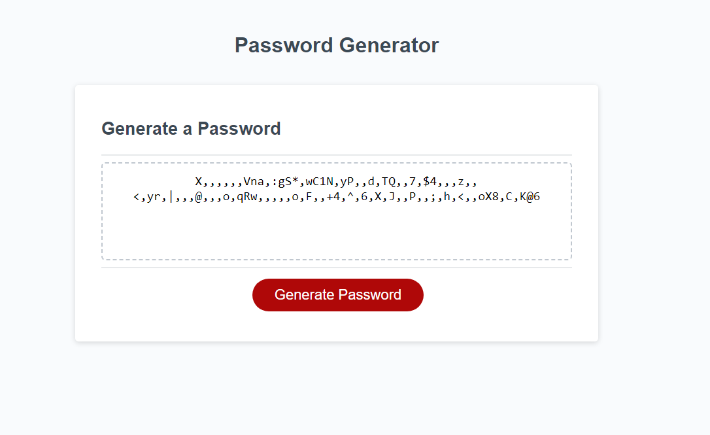

# <Your# Whats-my-password-again>

## Description

As a user who is tired of generating my own passwords,
I want to use an application that can generate secure passwords for me.
Therefore, I approached the client who suggested using Chat GPT to fulfill this requirement.


## User Story

```
User is tired of making their own password, client did some research on Chat GPT but code isn't working. CLient reached out to see if I wanted to take on the task. I said "yes" here we are now. 
```


## Acceptance Criteria

```
GIVEN I need a new, secure password
WHEN I click the button to generate a password
THEN I am presented with a series of prompts for password criteria
WHEN prompted for password criteria
THEN I select which criteria to include in the password
WHEN prompted for the length of the password
THEN I choose a length of at least 8 characters and no more than 128 characters
WHEN asked for character types to include in the password
THEN I confirm whether or not to include lowercase, uppercase, numeric, and/or special characters
WHEN I answer each prompt
THEN my input should be validated and at least one character type should be selected
WHEN all prompts are answered
THEN a password is generated that matches the selected criteria
WHEN the password is generated
THEN the password is either displayed in an alert or written to the page

## Usage

For top sercret projects 

To add a screenshot, create an `assets/images` folder in your repository and upload your screenshot to it. Then, using the relative filepath, add it to your README using the following syntax:

    ```md
  
    
    
    ```

## Technology
HTML
CSS
JavaScript

Installation
Clone the repository: git clone git@github.com:DayesCamara/Whats-my-password-again.git
Navigate to the project directory: cd your-repo
Open the index.html file in your preferred web browser.

## How to run
How to Run
To run the application, simply open the index.html file in your web browser. The application will load, and you can then follow the on-screen prompts to generate a secure password.

## Development Process
During the development of this project, the following steps were undertaken:
Analyzed the requirements and user expectations.
Designed the user interface and password generation logic.
Implemented the necessary HTML, CSS, and JavaScript code.
Collaborated with the client to address feedback and make necessary improvements.